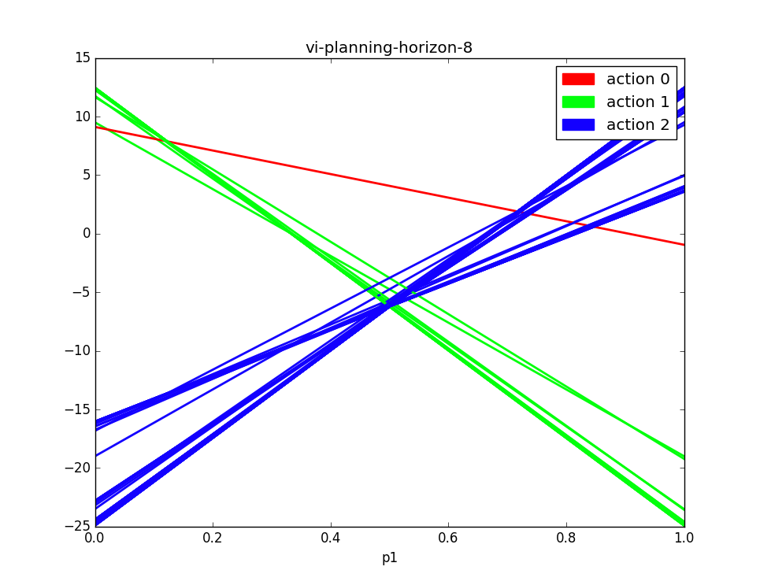
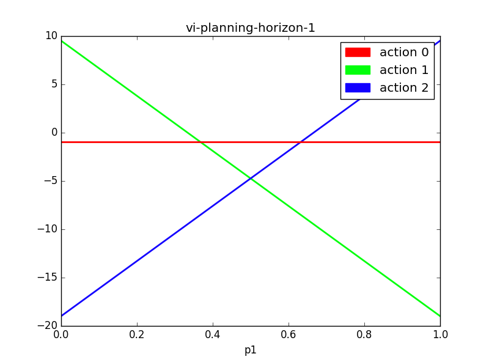

# Experiment Notes

To determine whether it is possible to approximate a value function for a small POMDP, I 
used simple linear function approximation to predict the pruned set of alpha vectors. For the Tiger 
problem, one can visually inspect the value function with a planning horizon of eight, and see that it can be
approximated by three well-placed alpha vectors. Using the one-step rewards for each of the three actions
as a basis function, I computed the three alpha vectors as follows:

<insert MathJax equation here>

where each alpha vector has the same dimension as the belief state space. I initialized all weights to 1.0, so that
the agent essentially started learning from a planning horizon of 1 (greedy action-selection with no planning).

The goal of this learning task is to determine whether the classic value iteration algorithm having exponential
run time complexity can be avoided with function approximation. For baselines, I compared against planning horizons
of one and eight, computed with Lark's pruning algorithm, as well as a random agent. 

## Baseline Results

*Results averaged over 5 experiments with different random seeds*

| planning horizon | epochs/experiment  | mean reward/epoch | std dev reward/epoch | mean wrong door count  |
|---|---|---|---|---|
| 8 | 1000 | 4.703091980822256 | 8.3286422581 | 102.4 |
| 1 | 1000  | 4.45726700400672 | 10.3950449814 | 148.6 |
| random | 1000  | -5.466722724994926  | 14.6177021188  | 503.0 |

The mean wrong door counts represent the number of times the agent opened the door with the tiger.

Here are plots of the alpha vectors returned by the classic value iteration algorithm.
There are 77 alpha vectors in the value function for the planning horizon of 8.






## Linear Function Approximation

The best results so far were obtained with the following parameters: 

```python
{'beta': 0.001,
 'discount': 0.95,
 'env': 'Tiger',
 'epsilon_decay': 0.99,
 'epsilon_decay_step': 75,
 'epsilon_minimum': 0.02,
 'epsilon_start': 0.2,
 'learning_rate': 0.05,
 'learning_rate_decay': 0.996,
 'learning_rate_decay_step': 50,
 'learning_rate_minimum': 0.00025,
 'max_steps': 50,
 'n_epochs': 1000,
 'planning_horizon': 5,
 'preferred_actions': False,
 'save': False,
 'seed': 123,
 'solver': 'LinearAlphaNet',
 'test': 10,
 'use_tf': True}
```

* mean undiscounted return per epoch was `4.251`
* std dev for undiscounted return was `9.486`
* mean discounted return per epoch was `3.997`
* std dev for discounted return was `9.008`
* wrong door count: 16

### Results
* experiments/results/LinearAlphaNet-best


